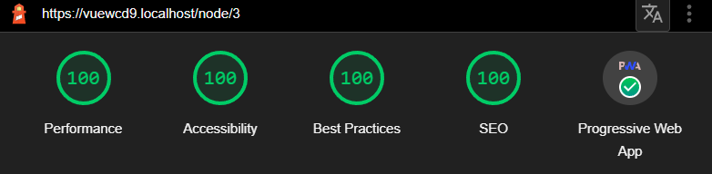

# Vue ❤️ Web Components ❤️ Drupal

[Demo](https://whatami.woldtwerk.de)

## What is this about?

Drupal theming layer is very complex and FE devs need intense knowledge about Drupal 
to build good frontends.

Since we are far away to build fully decoupled drupal applications a hybrid approach 
the only feasible solution.

This project lets drupal render pages like normal in a SSR matter. In the drupal 
template web components are included and hydrated with drupals ssr data.

E.g. Node Template:

```twig







<node-{{ variant_or_viemode }} {{ attributes }}>
  <div slot="title_prefix">{{ title_prefix }}</div>
  <div slot="title_suffix">{{ title_suffix }}</div>
  <div slot="metadata">{{ metadata }}</div>
  <div slot="author_picture">{{ author_picture }}</div>
  <div slot="author_name">{{ author_name }}</div>
  <div slot="date">{{ date }}</div>
  {{ content }}
</node-{{ variant_or_viemode }}>
```

The data is put into the WC either as a slot or as a prop. Only a single template is 
needed for node-full and node-teaser.

By using slots for field and meta data drupal amazing meta data is kept intact. 

It's also possible to include vue components inside vue custom elements:

```vue
<script setup lang="ts">
import Header from './Header.vue'
</script>

<template>
  <Header/>
</template>
```

This allows easy decoupling of "islands". For example a menu can be build very easily:

```vue
<script setup lang="ts">
import { onBeforeMount, ref } from 'vue'

interface MenuItem {
  href: string
  title: string
}

const navigation = ref<Array<MenuItem>>([])

onBeforeMount(async() => {
  const response = await fetch('/system/menu/main/linkset')
  const json = await response.json()
  const linkset = json.linkset
  navigation.value = linkset[0].item
})

</script>

```

Using vue components in web components usually looses all your styles. This and many 
other things were fixed by using a custom api. The styles of vue components and vue 
custom elements inject the styles as a constructed stylesheet when supported.
This is highly efficient. This also allows to inject large stylesheets in every
WC.

By large stylesheet I'm obviously talking about tailwind =) It's possible to use 
tailwind in twig files and every single WC and vue component! This also works with 
hmr (both css and vue changes).

You might think that it's stupid to client side render stuff that could be server 
side rendered, but the performance is excellent!

FrontPage:  


Node:


## Summary
✔️ Vue  
✔️ tailwindcss  
✔️ amazing HMR  
✔️ decoupled islands  